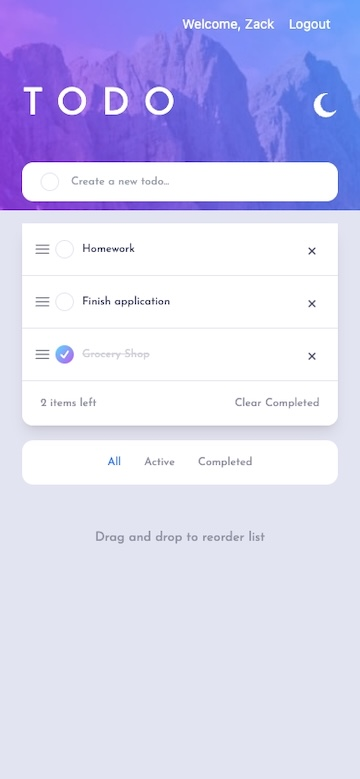
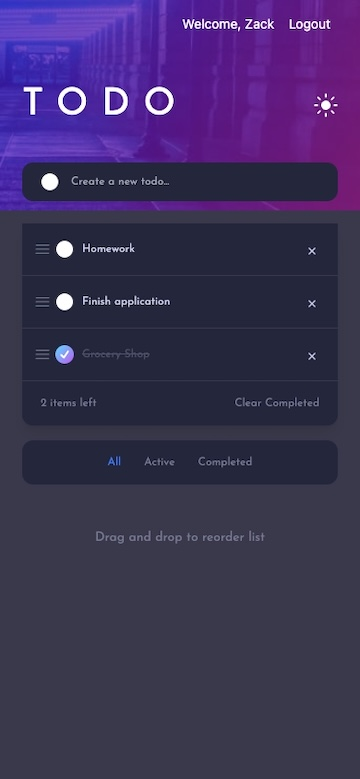
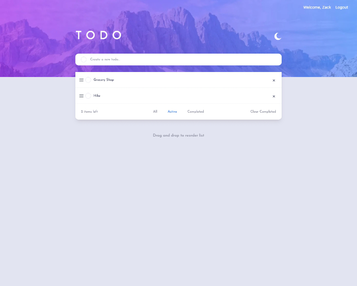
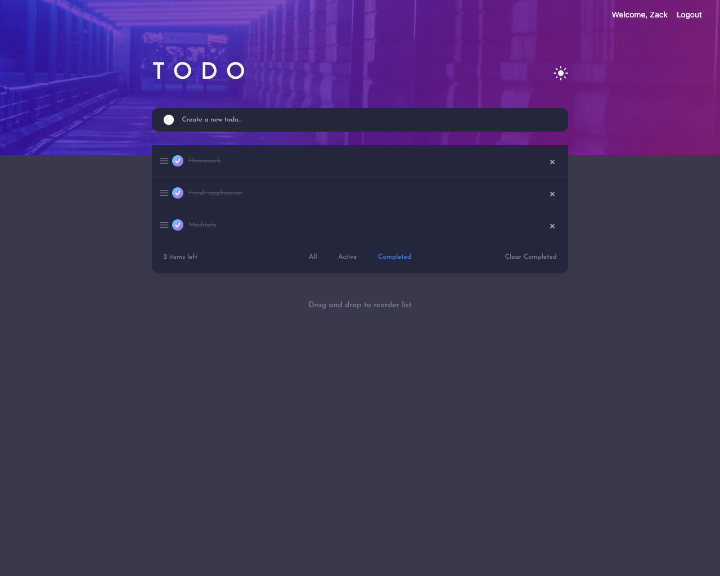

# Reactive Todos

A MERN stack task manager with a React front end and a node, express, and MongoDB backend.

Users should be able to:

- View the optimal layout for the app depending on their device's screen size
- See hover states for all interactive elements on the page
- Add new todos to the list
- Mark todos as complete
- Delete todos from the list
- Filter by all/active/complete todos
- Clear all completed todos
- Toggle light and dark mode
- **Bonus**: Drag and drop to reorder items on the list


## Installation

Clone Reactive-Todos from github, switch the directory to the outermost folder and run the command to install all dependencies needed for the project. 

```bash
  git clone _url_
  cd Reactive-Todos
  npm run installDeps
```
See section on .env variables and adjust the .env.example file to contain the necessary data, then start the project

```
    npm run develop
```
## Screenshots







## License

[MIT](https://choosealicense.com/licenses/mit/)


## Tech Stack

**Client:** React, React Context, TailwindCSS, Typescript, Dnd Kit, Vite   
**Server:** Node, Express, Mongodb, Mongoose


## Author

- [@Zacharycampanelli](https://www.github.com/Zacharycampanelli)
- [Linkedin](https://www.linkedin.com/in/zacharycampanelli/)


## Environment Variables

To run this project, you will need to add the following environment variables to your .env file

`MONGODB_URI` The url of the connected Mongo Database  
`PORT` Port used by the server  
`JWT_SECRET` Secret to encrypt authentication information  
`EMAIL`User email  
`PASSWORD` User password   
`CLIENT_URL` Front end port -- 